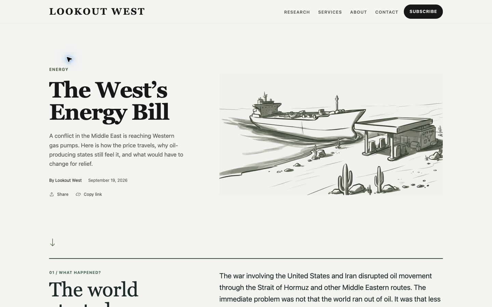
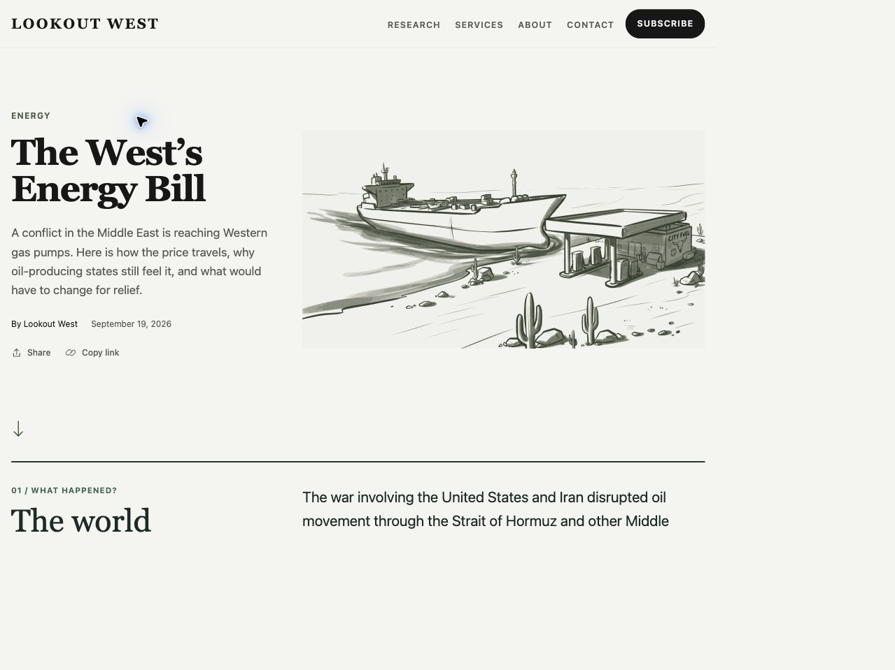
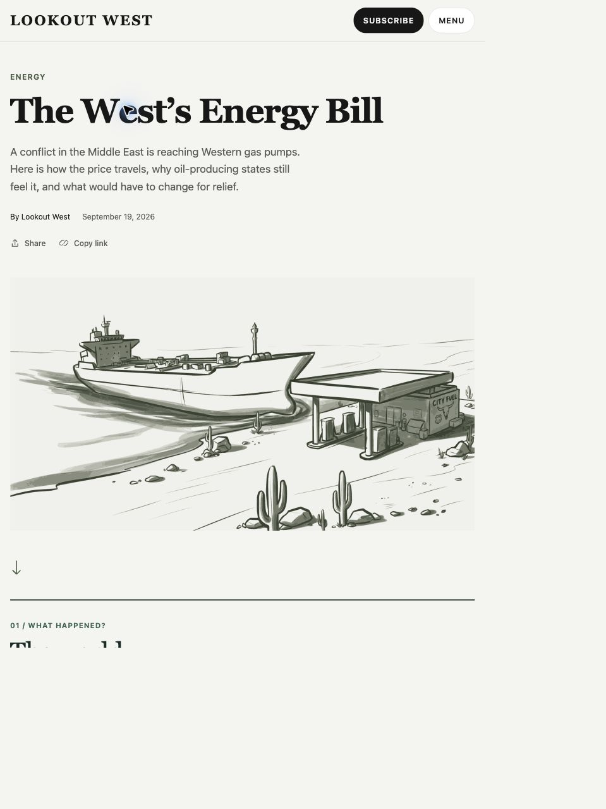
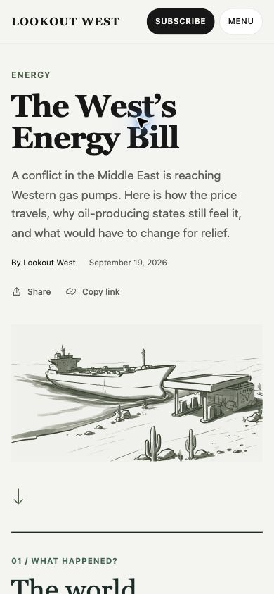
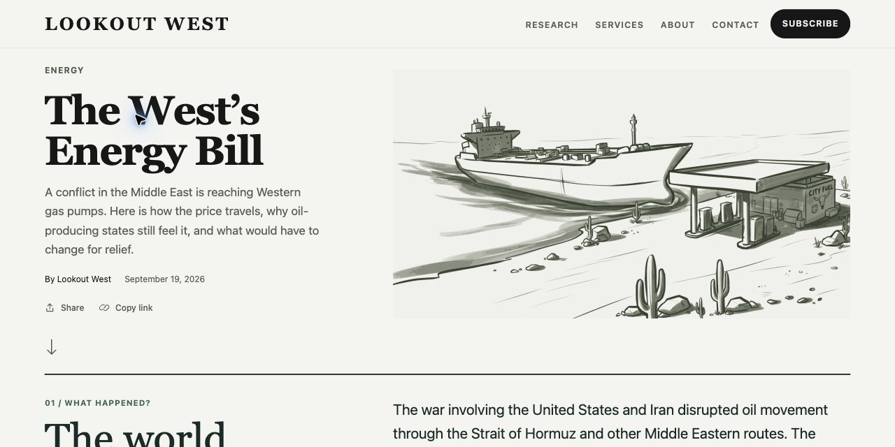

# Energy opening review

Implemented a split editorial hero, preserving the existing title, deck, author, publication date, navigation, fonts, colors, share controls, and subsequent story. Removed the blue station hero, its introductory question/copy, and the short-answer section. The first chapter now follows the hero directly.

## Artwork

The supplied SVG is static: it contains paths, groups, a rectangle, and a title; no animation, script, CSS, external dependencies, or reduced-motion variant. No motion was added. The original in Downloads was left untouched.

The bundled copy removes XML/interelement whitespace and redundant trailing decimal zeros without rounding coordinates. XML structure, attributes, command sequence, exact coordinate values, and rendered pixels were checked against the original. Size falls from 1,506,796 to 1,399,872 bytes (7.1%). The image reserves its 1408:768 aspect ratio and has descriptive alternative text. Its full composition and original colors are retained.

## Visual review

Two screenshot passes covered approximately 1440×900, 1024×768, 768×1024, 390×844, and a short 1280×640 viewport. First-pass captures include browser chrome. Final screenshots show the production build.

Refinements after inspection:
- Match the hero gutter to the chapter grid at both desktop breakpoints.
- Give the tablet title enough width to read on one line.
- Reduce spacing only on short desktop viewports. At 1280×640 the first chapter heading begins at approximately y=597.

Verified two-line title wrapping at desktop and phone widths, intact artwork proportions, no horizontal overflow, explicit image geometry, subordinate metadata, and the chapter transition. The supplied artwork has no playback to test and is already static for reduced-motion users.

Keyboard verification: Tab reaches the 44×44 arrow with a visible outline; Enter changes the hash to #what-happened and focuses that section. The relocated share control opens the existing sharing dialog by keyboard; Escape closes it. New text and control colors have contrast ratios of 6.19:1 or better on the existing page background. There is one article h1, followed by the first chapter h2.

## Checks

- Astro check: 0 errors, 0 warnings, 0 hints.
- Production build: 36 pages built successfully.
- Energy tests: 18 passed.
- Sharing tests: 11 passed.

## Final screenshots

